<p align="center">
  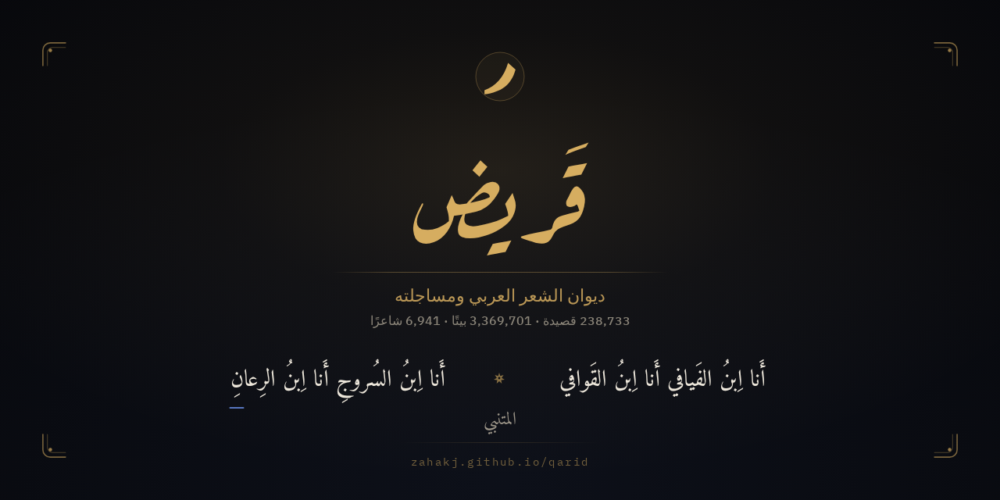
</p>

<p align="center">
  <a href="LICENSE"></a>
  
  
  
  <a href="SECURITY.md"></a>
</p>

<p align="center">
  <a href="https://zahakj.github.io/qarid/"><b>zahakj.github.io/qarid</b></a>
</p>

<div dir="rtl">

**قَريض** اسمٌ قديمٌ للشعر. وهذا ديوانٌ للشعر العربيّ يُقرأ ويُبحث فيه، ومساجلةٌ تُلعب عليه.

3,369,701 بيتًا لـ6,941 شاعرًا في مِعلَمٍ واحد من SQLite للقراءة فقط: يُتصفَّح بالعصر والبحر والغرض والرويّ، ويُبحث فيه بـFTS5، ويُلعب. في المساجلة يُلقي الحاسوبُ بيتًا ويُجاب ببيتٍ يبدأ **برويّه**، والحكمُ على مذهب القدماء لا يُقبل فيه القريب.

يعمل على الوِب وعلى أندرويد من مصدرٍ واحد. الواجهةُ كلُّها بالعربيّة، من اليمين إلى اليسار، بخطَّي أميري وعارف رقعة.

</div>

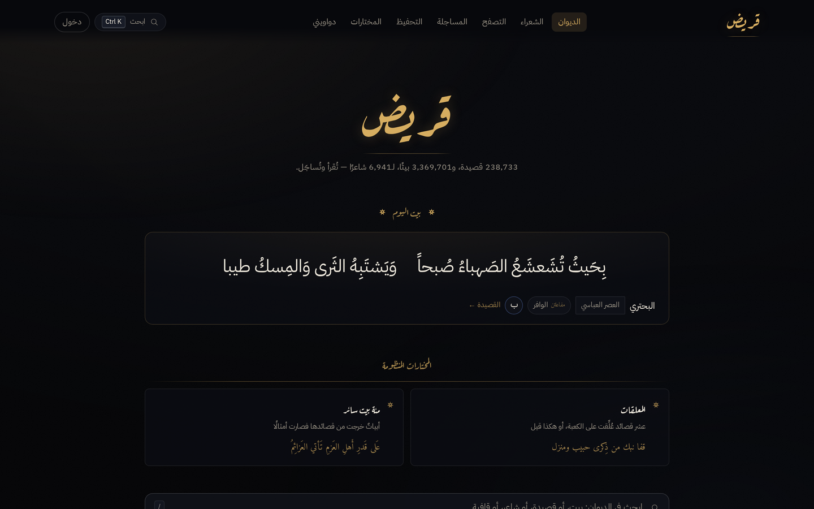

| | |
|---|---|
| 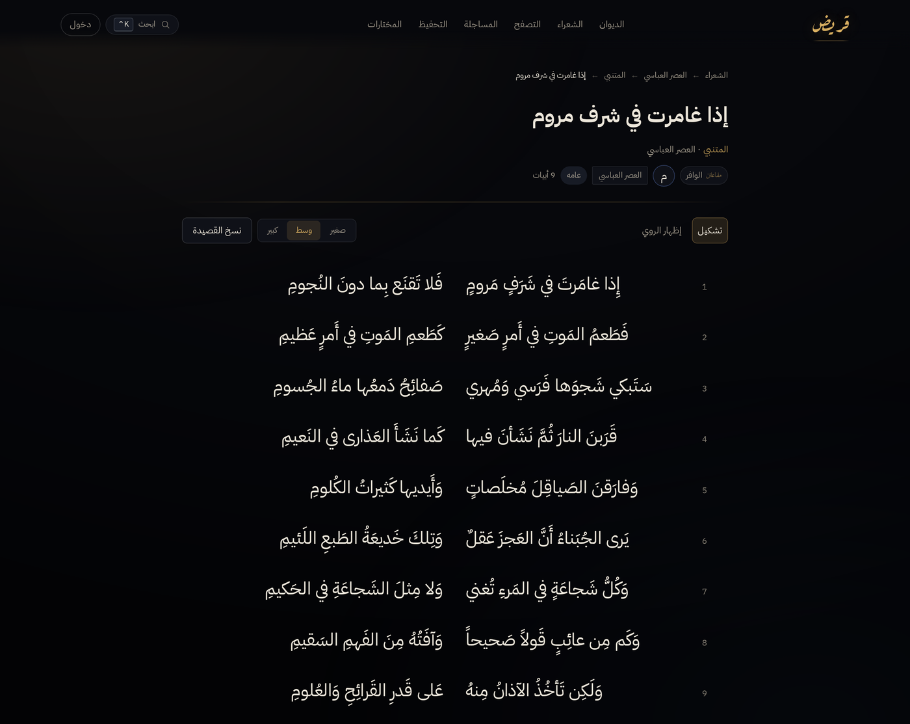 | 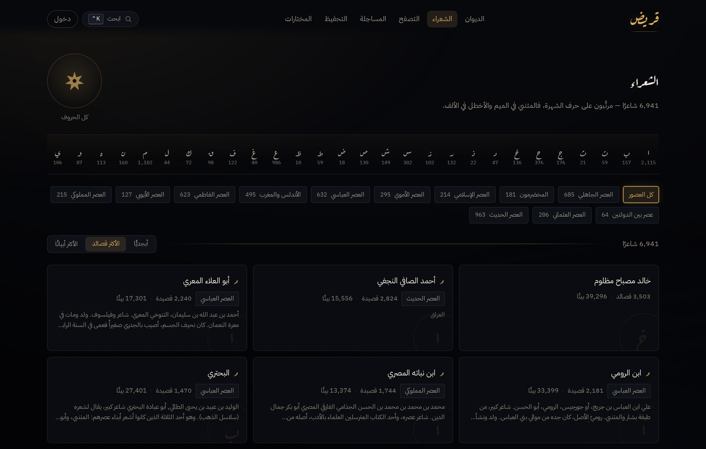 |
| <div dir="rtl">القصيدة صفحةَ ديوان</div> | <div dir="rtl">الشعراء على حروف الشهرة</div> |
| 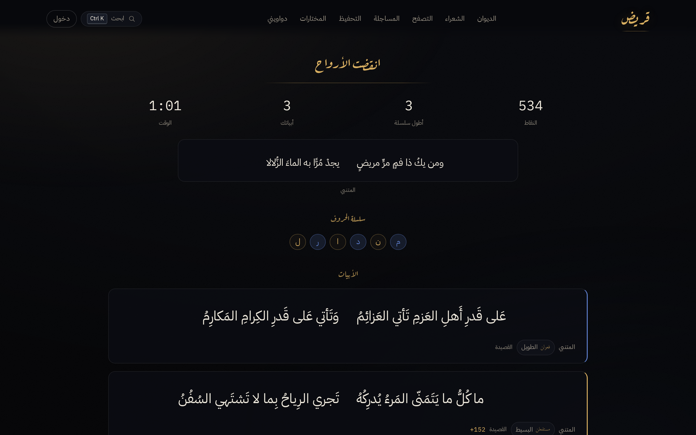 | 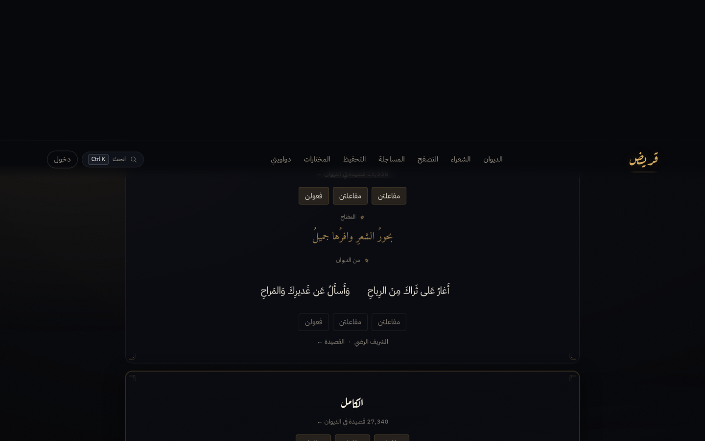 |
| <div dir="rtl">مساجلة</div> | <div dir="rtl">البحور الستّة عشر، ولكلٍّ شاهد</div> |
| 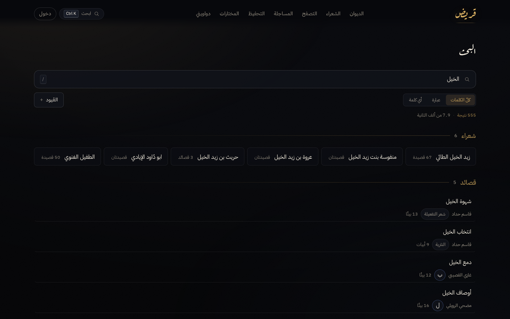 | 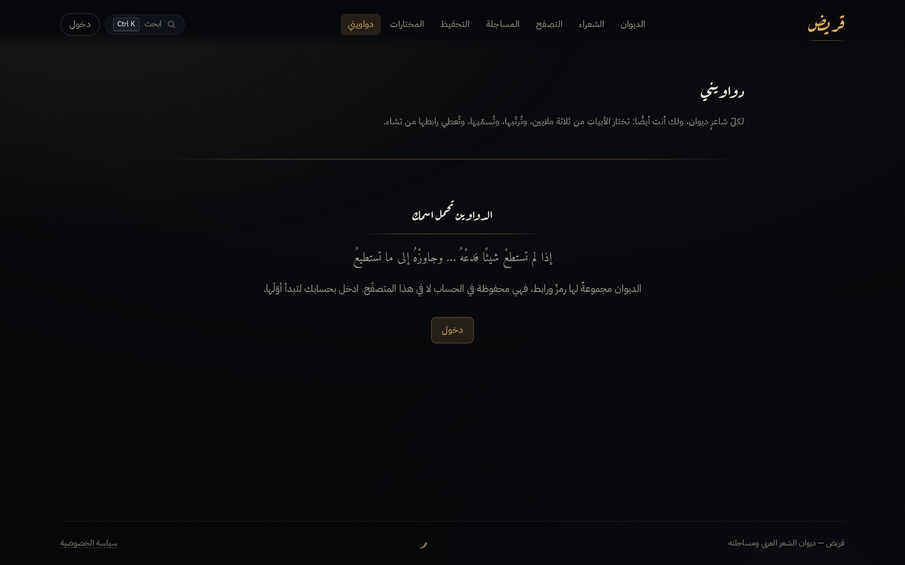 |
| <div dir="rtl">البحث</div> | <div dir="rtl">الدواوين</div> |

<p align="center">
  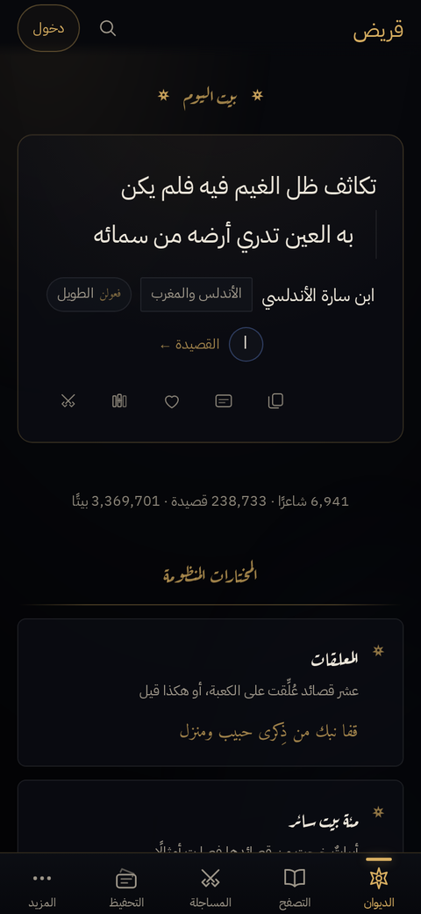 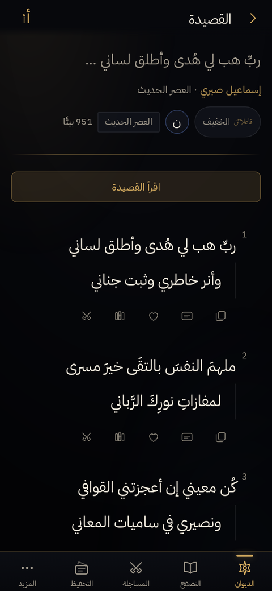 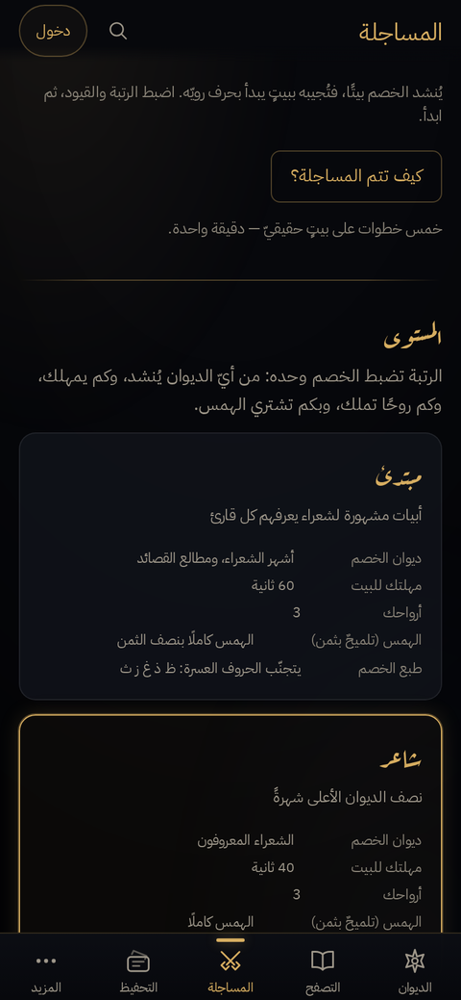
</p>

<div dir="rtl">

## ما فيه

**القراءة.** تصفّحٌ بالعصر والبحر والغرض والرويّ. ديوانُ كلِّ شاعر. والقصيدةُ صفحةً كما تُطبع، أو في وضع قراءةٍ تنزوي فيه الأدواتُ كلُّها. تشكيلٌ يُظهَر ويُخفى، وثلاثةُ مقاسات، والرويُّ يُخطُّ تحته عند الطلب.

**المساجلة.** ضدّ الديوان، بعدٍّ ووقت، وترسانةٍ من الحروف التي ثبت أنّها تُجاب عليها. أو ضدّ صديقٍ في غرفةٍ على WebSocket، والحكمُ عند الخادم لا عند اللاعب.

**الحفظ.** المختاراتُ قائمةٌ في المتصفّح بلا حساب. والدواوينُ رفوفٌ مُسمّاةٌ مرتَّبةٌ على حساب: تُجمَع، وتُرتَّب باليد، وتُشارَك، وتُلعب فيها المساجلة.

**التحفيظ.** تمرينٌ على القصيدة حتى تثبت. والمختاراتُ المنظومة رفوفٌ منتقاة — المعلّقاتُ العشر، ومئةُ بيتٍ سائر — تُحلُّ على المتن عند التشغيل لا تُنسَخ منه.

## التشغيل

يلزم **Node 24 فما فوق** — يُشغِّل TypeScript مباشرةً بلا بناءٍ للخادم — ونحوُ 1.6 غ.ب للمِعلَم.

</div>

```sh
git clone https://github.com/ZahakJ/qarid && cd qarid
npm install
cp .env.example .env          # ثم يُضبط PUBLIC_ORIGIN

# ملفّات arbml/ashaar (parquet) في data/raw/ ثم:
npm run ingest                # نحو 3 دقائق، 700 م.ب ذروةً، 1.6 غ.ب ناتجًا

npm run dev:server & npm run dev
```

<div dir="rtl">

وبلا متن:

</div>

```sh
npm run ingest:fixture        # عيّنةٌ من test/fixtures/ في ثوانٍ
```

<div dir="rtl">

في الإنتاج يربط الخادمُ على loopback وحده ويقدّم العميلَ المبنيَّ بنفسه؛ يُوضع أمامه وكيلٌ أو نفقٌ للـTLS. و`deploy/qarid.service` وحدةُ systemd للمستخدم.

</div>

```sh
npm run build && npm start
```

<div dir="rtl">

وحدُّ الإنجاز أربعةٌ كلُّها خضراء:

</div>

```sh
npm run typecheck && npm test && npm run build && npm run smoke
```

<div dir="rtl">

`npm run smoke` يشغّل الخادمَ الحقيقيَّ ويمشي على 29 مسارًا بعرضَي الحاسوب والهاتف في Chromium، ويفشل على أيّ خطأٍ في السجلّ.

## البناء

حزمةُ npm واحدة. الخادمُ على **ثلاثٍ** — `hono` ومحوِّلاه لـNode — و`node:sqlite`؛ والعميلُ على React وzustand وzod.

- **`shared/`** طبقةُ العقد التي يستوردها الطرفان: مُطبِّعٌ عربيٌّ واحد، ومنسِّقُ أعدادٍ واحد، ومولِّدٌ عشوائيٌّ مبذور، ومخطّطاتُ zod مرجعًا لكلِّ ما على السلك.
- **`scripts/ingest/`** يُدخل `arbml/ashaar` في مِعلَم SQLite للقراءة فقط على مرورَين. بـNode لا بـPython كي يستورد المُطبِّعَ نفسَه الذي يستورده الخادم، فلا ينحرفان.
- **`server/`** Hono على `node:sqlite`، يُفتح **للقراءة فقط** فتُرمى الكتابةُ العارضة بدل أن تُفسد المتن. `app.ts` بلا استماع، فتُقاد الاختباراتُ داخل العمليّة.
- **`client/`** Vite وReact، توجيهٌ بالكسر، من اليمين إلى اليسار. راسمُ بيتٍ واحد، وراسمُ بطاقةٍ واحد، ومنسِّقٌ واحد.

المِعلَم ثابتٌ عند التشغيل. قاعدةُ الحسابات وحدها تُكتَب، وهي ملفٌّ مستقلّ. ملاحظاتُ التصميم في [`docs/`](docs/)، والثوابتُ — بقياساتها التي اكتُسبت بها — في [`CLAUDE.md`](CLAUDE.md).

## المتن

الأبياتُ من [**arbml/ashaar**](https://huggingface.co/datasets/arbml/ashaar). يُدخَل ويُطبَّع ويُفهرَس، ولا يُعاد نشرُه: `data/` ليست في المستودع، والمِعلَم يُبنى محلّيًّا.

يُقرأ 254,630 قصيدة، ويُحذف 15,891 مكرّرةً و6 بلا أبيات، فتبقى 238,733. ومن 3,369,701 بيتٍ يصلح للمساجلة **1,713,459**: البيتُ يحتاج شطرَيه ورويًّا يُستخرج.

والمتنُ مكشوطٌ ويظهر ذلك: عناوينُ كثيرةٌ هي المطلعُ منزوعَ التشكيل، و39.8% من القصائد بلا بحر، وأبياتٌ فقدت شطرًا في الطريق. يُتعامل مع ذلك ولا يُدّعى خلافُه، وما يُحسن أن يُعرف قبل «إصلاحه» مدوَّنٌ في [`CLAUDE.md`](CLAUDE.md).

## الرخصة

[AGPL-3.0-or-later](LICENSE). من شغّل نسخةً معدَّلةً خدمةً على الشبكة فعليه أن يتيح مصدرَها.

المتنُ على شروط أصحابه. والخطوطُ [أميري](https://github.com/alif-type/amiri) و[عارف رقعة](https://github.com/aliftype/aref-ruqaa) وIBM Plex Sans Arabic وMono، كلُّها OFL.

</div>
