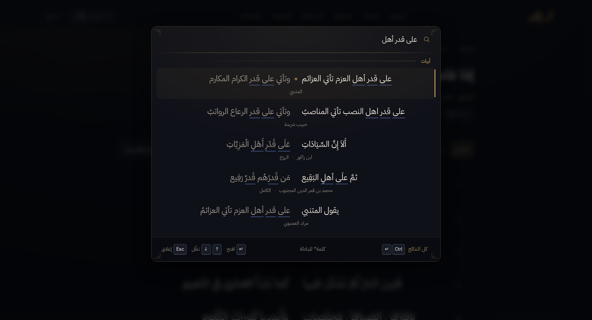
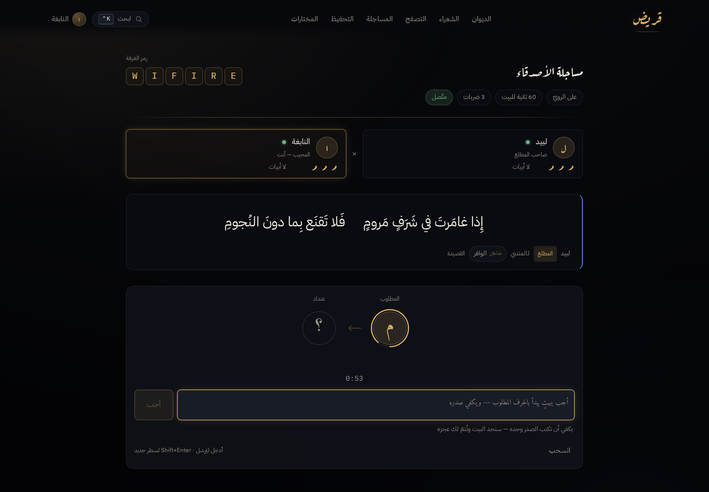
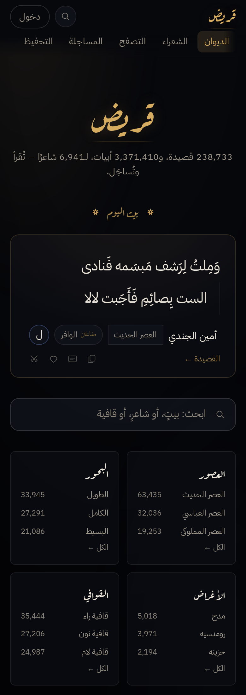

<p align="center">
  
</p>

<div dir="rtl">

# قَريض v2.0.0 — «اطرقِ البابَ»

كانت النسخةُ الأولى ديوانًا يُقرأُ ومُساجَلةً تُلعَبُ وحدَك. وهذه النسخةُ
تفتحُ البابَ لغيرِك: صارَ لك حسابٌ وصفحةٌ باسمِك، وصارَ في القريضِ **غُرَفٌ
تُساجِلُ فيها صديقًا** على شبكةٍ حيّةٍ حَكَمُها الخادمُ وحدَه — يدخُلُها من
تُرسِلُ إليه الرابط، أو من لم يبلغْه إلّا الرمزُ منطوقًا فيطرقُ البابَ
وتأذنُ له. وصارَ البحثُ على بُعدِ `Ctrl+K` من أيِّ صفحة، وصارَ للمبتدئِ
**وضعُ تدريبٍ** يُريه ما يصلحُ جوابًا قبلَ أن يخسَرَ به رُوحًا. ثمّ صارَ
القريضُ يُثبَّتُ على الهاتفِ — تطبيقَ ويبٍ يعملُ بلا اتّصال، وتطبيقًا
موقَّعًا على أندرويد. وقبلَ أن يُفتَحَ هذا كلُّه للناس، مرّت عليه **مراجعةُ
تحصينٍ أصلحت اثنتَي عشرةَ ثُغرةً مُؤكَّدة**، مذكورةٌ كلُّها بأسمائِها في
النصفِ الإنجليزيِّ من هذه الصفحة — فما يأخذُ كلمةَ سِرٍّ ويُدير لعبًا بين
اثنين لا يليقُ به أن يسكُتَ عمّا كان فيه.

## الجديد

### البحثُ السريع



`Ctrl+K` — و`Ctrl+F` أيضًا، انتُزِعت من المتصفِّح عن قصد — تفتحُ لوحةً واحدةً
فيها **أبياتٌ وقصائدُ وشعراء**، مِن أيِّ صفحةٍ كنت، حتّى وأنت تكتبُ في صندوقِ
الجواب. والشُّعراءُ فيها مرتَّبون بالشُّهرةِ لا بالوزنِ الآليّ وحدَه، فـ«المتنبي»
هو أوّلُ من يُذكَرُ إذا كتبتَ «المتنبي». ونجمةٌ في آخرِ الكلمةِ تعني ما بدأ بها.
و«البحث» لم يعُدْ بابًا في الشريطِ الأعلى — صارَ العلامةَ ⌕ — وصفحةُ `#/search`
باقيةٌ للنتائجِ الطويلةِ والروابطِ المحفوظة.

### الحسابُ والمِلَفّ

اسمٌ وكلمةُ سِرّ، لا بريدَ ولا غيرَه. وللحسابِ صفحةٌ — `#/u/<اسمك>` — فيها
تاريخُ انضمامِك، وسِجِلُّ مُساجَلاتِك، وترسانتُك إن شئتَ رفعَها. والديوانُ
كلُّه يبقى مقروءًا بلا حساب؛ إنّما الحسابُ للمُساجَلةِ باسمِك.

### مُساجَلةُ الأصدقاء



«ضدَّ صديق»: غرفةٌ، وبيتُ افتتاحٍ تنتقيه، ورمزٌ من ستّةِ أحرفٍ يُنطَق. وبابان
للدخول:

- **الرابط** — يحملُ مفتاحَ الغرفةِ معه، فمن فتحَه جلسَ في المقعدِ الثاني من فورِه.
- **الطَّرْق** — «انضمّ إلى غرفةٍ بالرمز» ثمّ «اطرقِ البابَ»، فيرى صاحبُ الغرفةِ
  اسمَك فيَقبلُ أو يَرفض. الرمزُ يدلُّ على الغرفةِ، والإذنُ هو الذي يفتحُها.

والخادمُ هو الحَكَم: عندَه الساعةُ، وعندَه الدَّور، ولا يُقبَلُ بيتٌ إلّا
بحُكمِه؛ فإن انقطعت شبكتُك عُدتَ إلى مجلسِك كما تركتَه، ولا يُنهي دورَك إلّا
انقضاءُ وقتِه. ولصاحبِ الغرفةِ أن يُغلِقَها متى شاء، وللغُرَفِ المهجورةِ
كَنْسٌ تلقائيّ.

### وضعُ التدريب


في الإعدادِ صارَ لكلِّ خيارٍ سطرٌ يشرحُه بالعربيّةِ الواضحة — ما الذي تُغيِّرُه
المرتبة، وما الفرقُ بينَ الوصالِ والمبارزة، وما معنى وضعِ السلسلةِ بمثالٍ حيٍّ
من بيتٍ حقيقيّ. وتحتَ صندوقِ الجوابِ سطرٌ لا يغيبُ: **يكفي أن تكتبَ الصدرَ
وحدَه**. و**وضعُ التدريب** يرفعُ إلى جانبِك رِفًّا من أبياتٍ حقيقيّةٍ تصلحُ
جوابًا لِما بينَ يديك، وثمنُه مُعلَنٌ — نصفُ النقاط.

### على الهاتف



**تطبيقُ ويب**: ثبِّتْه من المتصفِّح، فتفتحُ صَدَفتُه ولو انقطعَ الاتّصال.
و**تطبيقُ أندرويد** موقَّعٌ تجدُه في مُرفَقاتِ هذا الإصدار: مشاركةٌ بلوحةِ
النظام، ورَجْعٌ لمسيٌّ عندَ قبولِ البيتِ وردِّه، وشاشةٌ لا تنامُ في أثناءِ
دورِك، وروابطُ الغُرَفِ تفتحُ في التطبيقِ نفسِه.

### الشَّكل


مقياسٌ واحدٌ للفراغِ في التطبيقِ كلِّه، وشريطُ تمريرٍ مصبوغٌ بلونِ الحبرِ
والذهب، وصفحةُ الشُّعراءِ أُعيدَ بناؤها على رِفِّ حروفٍ وبطاقاتٍ ذاتِ طبقات،
وطبقةُ حركةٍ واحدةٍ تحكُمُ الدخولَ والتمرير — كلُّها تسكُنُ إذا طلبَ النظامُ
تقليلَ الحركة.

## التنصيب

- **على الوِب**: <https://qarid.example.com> — لا شيءَ يُنصَّب.
- **تطبيقُ ويب**: افتحِ الموقعَ واضغطْ «ثبِّت التطبيق».
- **أندرويد**: حمِّلْ مِلَفَّ `.apk` من مُرفَقاتِ هذا الإصدار وثبِّتْه
  (يحتاجُ الإذنَ بتثبيتِ تطبيقٍ من خارجِ المتجر). بصمةُ الشهادةِ في النصفِ
  الإنجليزيِّ أدناه، فتحقَّقْ منها قبلَ التثبيت.

## حدودٌ معروفة

- لا بريدَ في القريض، فلا استعادةَ لكلمةِ سِرٍّ ضاعت. صاحبُ الخادمِ وحدَه
  يستطيعُ حذفَ الحسابِ أو تغييرَ اسمِه.
- التطبيقُ ليس في متجرِ Play بعد؛ يُنصَّبُ من المِلَفِّ مباشرةً.

</div>

---

## Release notes (English)

**v2.0.0** — the release that made قريض a place two people can be at once.
v1.1 was a corpus browser and a solo duel; v2 adds accounts, server-authoritative
1v1 مساجلة rooms over a WebSocket, a global `Ctrl+K` / `Ctrl+F` palette, a
teaching mode for the duel, an installable PWA and a signed Android APK — and,
before any of that went public, a hardening pass that found and fixed twelve
confirmed security findings.

### What's new

**البحث السريع — the palette.** One overlay on every route, `Ctrl+K` *and*
`Ctrl+F` (the browser's find bar is deliberately hijacked; Escape closes). Three
groups — أبيات · قصائد · شعراء — with poets ranked by name-hit then fame then
bm25, because bm25 alone penalises a شاعر for *having* a biography and «المتنبي»
lost to «المشوق الشامي صديق المتنبي». A trailing `*` is an FTS prefix. The
chord lives in one capture-phase window listener, not in `useKeyboard`, so it
fires while you are typing into the duel's answer box.

**الحسابات — accounts + profiles.** A second, *writable* SQLite database
(`data/qarid-users.db`); the corpus artefact stays `readOnly` + `query_only=1`.
Username + password, no email. `#/u/<username>` carries joined date, match
record and an opt-in ترسانة snapshot. If the users database cannot be created,
the site still serves and only `/api/auth/*` answers 503.

**مساجلة الأصدقاء — rooms.** `POST /api/room` opens one; the host picks the
opening بيت; the room is decided **entirely server-side** — the clock is a
column, the turn order is derived from the `match_turns` rows and never from a
counter, and an answer runs the same `verifyAnswer` the solo duel calls. Two ways
in: the share link, which carries the room's join key, and **knock-to-join** for
someone who only heard the six-letter code aloud — «اطرق الباب», the host sees
the knocker's name and accepts or rejects. Plus a host «أغلق الغرفة» button and
automatic cleanup of stale rooms (waiting > 6 h, done > 7 d). A dropped socket
forfeits nothing; the polling fallback is the same snapshot the socket pushes.

**وضع التدريب — duel clarity.** Every setup option now carries a visible
one-line explanation in plain Arabic, with a live example rendered from a real
بيت for chain mode. The صدر-only rule is stated under the textarea where it
cannot be missed. Assist mode (`GET /api/game/assist`) raises a rail of real
corpus أبيات that would answer the line in front of you, fame-first, debounced —
and says its price out loud: half score.

**التطبيق — PWA + Android.** A hand-rolled service worker versioned by the build
hash (shell and fonts precached, API network-first, an offline page), a maskable
gold-nib icon set, and an install affordance in the masthead. Then Capacitor over
that same built shell: app id `com.example.qarid`, bearer-token sessions for a
WebView that cannot keep a cookie (issued on request, revoked wholesale on
password change, `Authorization` header only), a CORS allowlist composed with the
CSRF guard, share sheet, haptics, keep-awake, and `assetlinks.json` served by Hono
so a room link opens the app.

**الشكل — the design pass.** One 4/8 spacing scale everywhere, themed
scrollbars, a rebuilt شعراء tab (hero letter rail, layered cards, era chips), a
dedicated motion layer (`motion.css`, loaded last) with an eight-step entrance
stagger and hover micro-interactions, and the two colliding `.letter-well`
rules finally pulled apart. Reduced motion is honoured in two places, because a
collapsed duration with a live delay leaves an element invisible and then snaps
it in.

### Hardening

Twelve confirmed findings, each reproduced before it was fixed:

1. **No CSRF defence at all.** `SameSite=Lax` is computed on the registrable
   domain, and this box hosts sibling subdomains whose pages carry `qarid_sess`.
   A `text/plain` POST from a sibling renamed a signed-in reader's account, 200.
   `server/origin.ts` now guards every non-GET and the `/ws` upgrade, and a body
   must declare `application/json`.
2. **Seat sniping on an open room.** `joinRoom` seated whoever arrived first, so
   a stranger could take the guest chair the host had texted to a friend.
   `rooms.join_key` — 24 characters, in the share link, sent only to the two
   players — is the credential the six-letter code never was.
3. **The room code space was scannable.** 14³×5³ = 343,000 values with no rate
   limit on `/state` or `/join` (300 probes in 29 ms, no 429): every waiting room
   and live transcript. Every `/api/room/*` path is under `ROOM_READ_LIMIT` now.
4. **The `/turn` clock race.** The one async handler loaded the room row, awaited
   the body, and judged a stale `turn_deadline_at` — weaponisable with a slow
   body to end a match on a timeout that never happened. `resolveExpiry` re-reads
   the row by id; a caller's snapshot says *which* room, never what is in it.
5. **A phrase-star search DoS.** `PREFIX_MIN_LENGTH` counted the whole term while
   FTS5 stars only the last token, so `"يا ا"*` scanned the one-letter prefix:
   **19,799 ms** on one anonymous GET, with every other visitor queued behind it
   (SQLite is synchronous on the one event loop). 3 ms now, and `STAR_TERM_CAP`
   bounds *how many* stars, which the floor never did.
6. **Unthrottled socket frames.** `{"type":"state"}` had no throttle: 5,000
   frames bought 5,000 full snapshots, 36 MB out, `/api/meta` p50 from 5.0 to
   74.6 ms. Frames now spend `SOCKET_FRAME_LIMIT`, keyed on the **user** — a
   per-socket counter is defeated by opening a second socket.
7. **The profile leaked live room codes.** `GET /api/profile/:username` needs no
   cookie and `recentMatches` selected `r.code` with no status filter — an
   unauthenticated request returned the waiting invite of a live مساجلة, from a
   route with enumerable usernames and no limiter. The record stays public; the
   code is the account's own.
8. **Socket identity frozen at the upgrade.** The user was resolved once and
   closed over for the life of the connection, so deleting a session row — the
   only remediation this app has — left the tab playing forever, since every
   frame re-armed the idle timer. The session is re-read on every command.
9. **WebSocket turns bypassed the rate limiter.** `GAME_RATE_LIMIT` is Hono
   middleware and an upgrade never reaches it, so a `turn` frame ran the whole
   verify pipeline with no bucket at all.
10. **The rate limiter never evicted a bucket.** `sweep()` dropped a bucket when
    `tokens >= capacity`, but tokens refill lazily, so the predicate was
    unsatisfiable: 200,000 one-shot IPs retained 200,000 buckets and 208 MB —
    and the O(n) scan that deleted nothing ran on every new key. It refills
    before it judges, and sweeps at most once per window.
11. **Two clients, one timer slot.** `ws.onopen` parked the 20-second heartbeat
    in `pollTimer`, the slot `startPolling()` guards on, so a socket that opened
    and later dropped left the room refreshing every twenty seconds under a
    header chip promising two. Two intervals, two slots.
12. **The رجعة redirect loop, and a reconnect storm.** `rooms.rematch_code` is
    permanent and rides every later snapshot, so opening an old room from the
    profile bounced the reader through every generation 900 ms apart and no older
    transcript was reachable at all — only a code that arrives *while* you are in
    the room navigates now. And a fatal socket close (`unauthenticated`,
    `room_not_found`) used to reopen ~40 times in 16 s against a door that would
    never open; it stops and falls to the HTTP poller.

No external audit has been done, and none is claimed. The threat model is a
public read-mostly site with a handful of accounts.

### Install

- **Web** — <https://qarid.example.com>. Nothing to install.
- **PWA** — open the site and use the install affordance in the masthead (or the
  browser's own). The shell, fonts and icons are precached; the offline page
  explains that a ديوان is not read unplugged.
- **Android** — download the `.apk` from this release's assets and allow
  installation from an unknown source. 4.5 MB, app id `com.example.qarid`,
  `minSdk 24` (Android 7.0). **Verify the signature before you install it** —
  `apksigner verify --print-certs <the file>` must print:

  ```
  SHA-256: <your release certificate SHA-256>
  ```

  A build of this app that prints anything else was not signed with this key.

### Known limits

- **Native rooms authenticate over the bearer subprotocol.** A WebView cannot set
  an `Authorization` header on a WebSocket handshake, so the native shell offers
  its token as `Sec-WebSocket-Protocol: qarid.bearer.<token>`. The server reads
  subprotocol → header → cookie down one path, but the token is in a handshake
  header rather than a `Secure` cookie; it is TLS-only and revoked on password
  change, and that is the whole mitigation.
- **No email means no password reset.** A lost password is a lost account unless
  the server's owner edits the row.
- **Play Store deferred.** Distribution is this GitHub release and direct sharing
  of the APK; a listing needs a developer account and review, and that is the
  owner's call.
- The corpus keeps the source's damage — scraper artefacts in some مطالع, a
  form label where a بحر belongs, 39.8% of قصائد with no بحر at all. What is
  wrong in it is the source's; what is right in it is the poets'.

### Verified before shipping

1241 tests across 59 files · `npm run typecheck && npm test && npm run build &&
npm run smoke` green · the smoke walk over every route at 1440 and at 390 with
`hasTouch` · both `healthz` listeners (`127.0.0.1` and `::1`) · `/api/meta` at
238,733 · 3,371,410 · 6,941 · 1,709,893 (`build_id bbe2f944`) · a signed release
APK built locally from that same `dist/`, on this box, with no CI in the loop.
